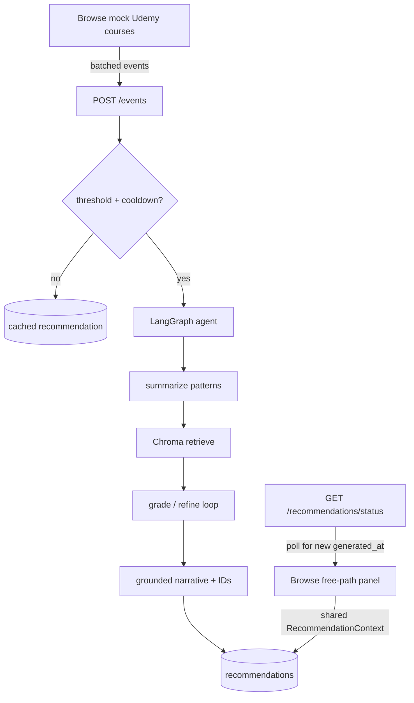

# SmartReco

Behavioral recommendation agent for a Udemy-style browse surface.  
**Paid marketplace views are signal only.** The agent recommends **admin-managed free catalog** resources (YouTube / docs) via LangGraph + RAG — never the paid listings themselves.

## Two datasets

| Dataset | Role |
|---------|------|
| Mock paid courses (`frontend` browse) | Interest **signal** (`view` / `search` / `click` / `time_spent`) |
| `free_resources` (Postgres + Chroma) | **Only** recommendable corpus (dual-written) |

## Architecture Honesty

SmartReco is a **hybrid** system. Judges reading the repo should not mistake
`app/agent/clustering.py` for the recommender.

| Layer | What it does | What it does *not* do |
|-------|----------------|------------------------|
| **Deterministic guardrail** (`clustering.py`) | Maps paid browse categories → broad families (e.g. React → frontend) to *scope* Chroma retrieval and demote off-family noise | Select final free resources, write the narrative, or invent catalog IDs |
| **LLM agent** (`agent/nodes.py`) | `summarize_activity`, `grade_retrieval`, `generate_recommendation` — interest reasoning, relevance grading, persuasive copy, **final ID selection** | Call providers directly (uses `mesh.py` adapter only) |
| **Chroma RAG** (`vector_store.py`) | Semantic search over dual-written free catalog | Decide which IDs the user sees (LLM generate picks among hits) |

**Plain statement:** no recommendation is ever chosen by the hardcoded family map alone.
Every final output is meant to pass through `generate_recommendation`'s LLM call, which
may only select IDs returned by Chroma's semantic search (then grounded against Postgres).
If the LLM is unavailable, a *fallback* still retrieves via Chroma using the family
guardrail for query scoping — it still does not pick from a hardcoded playlist.

### LLM provider swap (Mesh mandatory for submission)

`LLM_PROVIDER=mesh|groq|grok` plus the matching API key / model in `.env` is a
**config-only** change. Agent nodes call `chat_completion()` in `app/mesh.py`
(OpenAI-compatible adapter). No Grok/Groq-specific logic lives in LangGraph nodes.

## Architecture



**Why cache feels “stuck” sometimes:** that is intentional. The LLM does **not** run on every course open. The Dashboard shows the last grounded path until enough **new** signals arrive (default **5**) and cooldown (**45s**) elapses — or you press **Refresh**.  
Progress is visible via `GET /recommendations/status` (Browse strip + Dashboard bar).

## Stack

- **Backend:** FastAPI, Neon Postgres, Chroma + `sentence-transformers`, LangGraph, Mesh (OpenAI-compatible)
- **Frontend:** React + Vite + TypeScript

## Quick start

### Backend

```bash
cd backend
python -m venv venv
# Windows: .\venv\Scripts\activate
pip install -r requirements.txt
cp ../.env.example .env   # fill DATABASE_URL, JWT_SECRET, MESH_API_KEY
python seed_data.py       # admin + free catalog → Postgres + Chroma
uvicorn app.main:app --reload --host 0.0.0.0 --port 8000
```

Health: `GET http://localhost:8000/health`

Default admin: `admin@smartreco.dev` / `admin123`

### Frontend

```bash
cd frontend
npm install
# optional: echo VITE_API_URL=http://localhost:8000 > .env
npm run dev
```

### LLM provider

- **Submission (required):** `LLM_PROVIDER=mesh` + valid `MESH_API_KEY` (+ `MESH_MODEL` if needed)
- **Local/dev:** `LLM_PROVIDER=groq` or `LLM_PROVIDER=grok` with the matching key  
Switching providers is **config-only** — see Architecture Honesty above.  
If the LLM is rate-limited, the runner uses a Chroma + guardrail fallback (still not 1:1 view→video).

## Agent trigger rules

| Rule | Default |
|------|---------|
| New events since last rec | ≥ `EVENT_TRIGGER_THRESHOLD` (3) |
| Dominant family confidence | ≥3 same-family signals, OR only-family ≥2, OR strictly >2× next family — else skip with `insufficient_confidence` |
| Cooldown since last run | ≥ `EVENT_COOLDOWN_SECONDS` (45) |
| Or cache TTL expired | `RECOMMENDATION_TTL_HOURS` (24) |
| Manual | `POST /recommendations/refresh` |

`GET /recommendations/latest` and `GET /recommendations/status` never call the LLM.

## Key API routes

- `POST /auth/signup` · `POST /auth/login` · `GET /auth/me`
- `POST /events` · `GET /events`
- `GET /recommendations/latest` · `GET /recommendations/status` · `POST /recommendations/refresh`
- `GET|POST /catalog` · `PUT|DELETE /catalog/{id}` · `POST /catalog/{id}/resync` (admin)

## Expanding the corpus

- **Paid signal courses:** edit `frontend/src/data/mockCourses.ts`
- **Free recommendable resources:** Admin UI or `backend/seed_data.py` then `python seed_data.py` (dual-writes Chroma)

## Bonuses (optional / Phase 6)

- LangSmith tracing (`LANGSMITH_API_KEY`) — wire when ready
- APScheduler email digest — not required for core demo

## Demo flow

1. Signup → land on **Browse** (single primary page for users)
2. Open 2–3 related course details — events flush in the background
3. The ambient **free path panel** at the top of Browse updates in place (tags from `source_summary` + narrative + hero)
4. A small toast only says the panel updated — same shared `RecommendationContext` state (no second copy of content)
5. Admin keeps `/admin` for catalog dual-write

## Safety

Never commit `backend/.env`. Use `.env.example` only.
